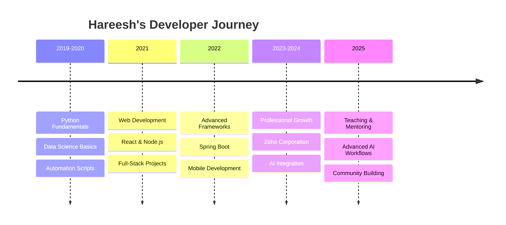

# Hi there 👋 It's me Loganth

<div align="center">

)

**Software Engineer @ Zoho Corporation**

[](https://hareesh.web.app)
[](https://twitter.com/hareesh_dev)
[](https://github.com/hareesh-r)

**📍 Chennai, Tamil Nadu, India | 🕐 IST (UTC+5:30)**

</div>

---

## 🚀 About Me

**Passionate about designing software that solve real-world problems.** Enthusiastic, hardworking individual and self-taught programmer involved in **Data Science** and **Software Engineering**.

- 🔭 **Portfolio**: [hareesh.web.app](https://hareesh.web.app)
- 🌱 **Currently**: Learning and Teaching **DSA** and Integrating **AI** to my workflow
- 🏢 **Engineering at**: [Zoho Corporation](https://zoho.com)
- ⚡ **Fun fact**: I know **Japanese** 🇯🇵
- 👥 **Community**: **1.4k followers** | **80 following**

---

## 💻 Tech Stack

### I code in
<div align="center">


</div>

### IDE and Tools I Use
<div align="center">


</div>

---

## 📊 GitHub Statistics

<div align="center">


</div>

---

## 🔥 Featured Projects

### 🤖 AI & Machine Learning
- **[Facial-Expression-Recognition-Keras](https://github.com/hareesh-r/Facial-Expression-Recognition-Keras)** - TensorFlow, Keras, OpenCV facial expression recognition model
- **[Zen-of-python](https://github.com/hareesh-r/Zen-of-python)** - Python notebook demonstrating Zen of Python principles

### 🌐 Full-Stack Applications
- **[fullstack-seminar](https://github.com/hareesh-r/fullstack-seminar)** - MERN stack CRUD application with MySQL
- **[API-Tutorial](https://github.com/hareesh-r/API-Tutorial)** - Comprehensive API explanation with client-server architecture
- **[HireFiesta](https://github.com/hareesh-r/HireFiesta)** - Job portal connecting employers and job seekers

### 🎯 Web Development
- **[google-hareesh](https://github.com/hareesh-r/google-hareesh)** - Google Clone with custom search API and dark mode
- **[netflix-hareesh](https://github.com/hareesh-r/netflix-hareesh)** - Netflix clone with React JS and Firebase
- **[acoustic-music](https://github.com/hareesh-r/acoustic-music)** - Music web app with Spotify API integration

### 🔧 Automation & Tools
- **[File-Seperator](https://github.com/hareesh-r/File-Seperator)** - Python automation script for file organization
- **[instagram-login-automation](https://github.com/hareesh-r/instagram-login-automation)** - Instagram automation for multilingual greetings
- **[youtube-unsubscribe](https://github.com/hareesh-r/youtube-unsubscribe)** - YouTube channel unsubscription automation

### 📱 Mobile & Modern Web
- **[flutter_firebase_integr](https://github.com/hareesh-r/flutter_firebase_integr)** - Flutter Firebase integration with authentication
- **[react-signals](https://github.com/hareesh-r/react-signals)** - React signals implementation
- **[springboot-hosting-catalyst](https://github.com/hareesh-r/springboot-hosting-catalyst)** - Spring Boot deployment solutions

---

## 🎯 Skills & Expertise

### **Programming Languages**
```javascript
const skills = {
    languages: ['Python', 'JavaScript', 'Java', 'TypeScript', 'Dart', 'HTML/CSS'],
    frameworks: ['React', 'Node.js', 'Spring Boot', 'Flutter', 'Express.js'],
    databases: ['MySQL', 'Firebase', 'MongoDB'],
    tools: ['Git', 'Docker', 'VS Code', 'Selenium', 'GraphQL'],
    specializations: ['Data Science', 'Machine Learning', 'Full-Stack Development', 'API Design']
}
```

### **Core Competencies**
- 🧠 **Data Science & ML**: TensorFlow, Keras, OpenCV, Data Analysis
- 🌐 **Full-Stack Development**: MERN stack, Spring Boot, API design
- 📱 **Mobile Development**: Flutter, React Native
- 🤖 **Automation**: Python scripting, Selenium WebDriver
- 🔐 **Authentication**: Firebase Auth, JWT, OAuth
- 📊 **Data Visualization**: Charts, Analytics, Reporting

---

## 💼 Professional Experience

### **Software Engineer @ Zoho Corporation**
- 🏢 **Location**: Chennai, Tamil Nadu, India
- 🛠️ **Focus**: Software design and development for real-world problem solving
- 📈 **Impact**: Contributing to enterprise-level software solutions
- 🌟 **Skills**: Full-stack development, system design, data science integration

### **Self-taught Developer Journey**
- 📚 **Continuous Learning**: DSA, AI integration, modern web technologies
- 👨‍🏫 **Teaching**: Sharing knowledge in Data Structures and Algorithms
- 🔧 **Problem Solving**: Creating automation tools and web applications
- 🌍 **Community**: Building projects that solve real-world problems

---

## 📈 GitHub Activity

<div align="center">


</div>

### 📊 **Contribution Overview**
- **Total Repositories**: 60+ public repositories
- **Languages**: TypeScript (97.3%), CSS (1.9%), Others (0.8%)
- **Community**: Active contributor to FOSS projects
- **Achievements**: Multiple GitHub achievements and recognition

---

## 🌟 Highlighted Achievements

- 🎯 **1.4K GitHub Followers** - Growing developer community
- 🏆 **Multiple GitHub Achievements** - Recognition for contributions
- 🌐 **Portfolio Website** - [hareesh.web.app](https://hareesh.web.app)
- 🇯🇵 **Multilingual**: English, Tamil, Japanese
- 🤝 **Open Source**: Contributing to community projects

---

## 🎨 Featured Skills Timeline



---

## 📞 Connect With Me

<div align="center">

[](https://hareesh.web.app)
[](https://twitter.com/hareesh_dev)
[](https://linkedin.com/in/hareesh-r)
[](mailto:contact@hareesh.web.app)

</div>

---

## 🏆 GitHub Trophies

<div align="center">


</div>

---

## 💻 Workspace Spec

```yaml
Operating_System: "Windows 11 / macOS"
Code_Editor: "VS Code"
Terminal: "PowerShell / Bash"
Browser: "Chrome DevTools"
Design: "Figma"
Database_Tools: "MySQL Workbench, Firebase Console"
Version_Control: "Git, GitHub"
```

---

## 📚 Currently Learning

- 🧠 **Advanced AI/ML**: Deep Learning, Neural Networks
- 🔗 **Blockchain**: Smart Contracts, Web3 development
- ☁️ **Cloud Technologies**: AWS, Azure, Google Cloud
- 🏗️ **System Design**: Scalable architecture patterns
- 🚀 **DevOps**: CI/CD, Kubernetes, Microservices

---

## 🎯 2025 Goals

- [ ] **AI Integration**: Master AI workflow integration in software development
- [ ] **Teaching**: Create comprehensive DSA and development courses
- [ ] **Open Source**: Contribute to major open-source projects
- [ ] **Community**: Build a strong developer community platform
- [ ] **Mentorship**: Guide aspiring developers in their journey

---

## 📊 Weekly Development Breakdown

```text
JavaScript   12 hrs 30 mins  ████████████░░░  65.8%
Python        3 hrs 45 mins  ████░░░░░░░░░░░  19.7%
TypeScript    1 hr 30 mins   ██░░░░░░░░░░░░░   7.9%
Java          1 hr 15 mins   █░░░░░░░░░░░░░░   6.6%
```

---

<div align="center">

### 🌟 "Code is poetry written for machines and humans alike" 🌟

**Thank you for visiting my profile!** 

*Let's build something amazing together* 🚀

[](https://github.com/hareesh-r)
[](http://hits.dwyl.com/hareesh-r/hareesh-r)

---

*"Passionate about designing software that solve real-world problems"* ✨

</div>
