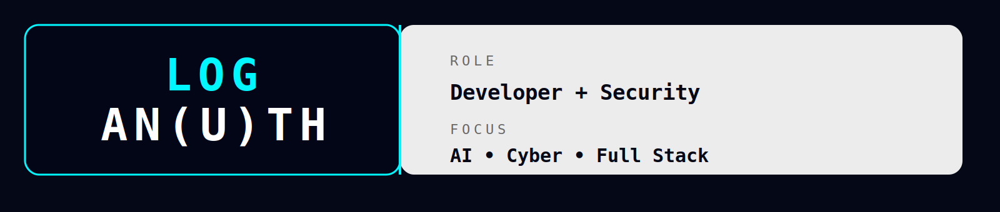

<p align="center">
  
</p>

<!-- 🧠 AI INTRO -->
<p align="center">
  
</p>

---

## 🧠 Profile

```yaml
name: Loganth
role: Developer + Security Enthusiast
focus: [Cybersecurity, AI, Full Stack]
philosophy: "Build → Break → Secure → Repeat"
```

---

## 🚀 What I Do

- 🔐 Design **secure systems & security tools**
- 🤖 Build **AI-powered applications**
- 🌐 Develop **scalable full-stack platforms**
- ⚡ Solve **real-world engineering problems**

---

## 🧰 Tech Stack

### 💻 Programming Languages

<p align="center">
  
</p>

### 🌐 Web Technologies

<p align="center">
  
</p>

### 🗄️ Databases & Cloud

<p align="center">
  
</p>

### ⚙️ Tools & Platforms

<p align="center">
  
</p>

---

## 📡 Live Activity Graph

<p align="center">
  
</p>

---


## 🌐 Neural Activity

<p align="center">
  
</p>

---
## 🌐 Connect • Network • Explore

<p align="center">

<a href="https://www.linkedin.com/in/loganth-p-158667280/" target="_blank">
  
</a>

&nbsp;&nbsp;

<a href="https://leetcode.com/u/loganthp-1910/" target="_blank">
  
</a>

&nbsp;&nbsp;

<a href="https://www.hackerrank.com/profile/loganth_1925" target="_blank">
  
</a>

</p>

<br>

<p align="center">

<a href="https://www.linkedin.com/in/loganth-p-158667280/" target="_blank">
  
</a>

&nbsp;&nbsp;&nbsp;&nbsp;

<a href="https://leetcode.com/u/loganthp-1910/" target="_blank">
  
</a>

&nbsp;&nbsp;&nbsp;&nbsp;

<a href="https://www.hackerrank.com/profile/loganth_1925" target="_blank">
  
</a>

</p>

<br>

<p align="center">


</p>

---

<p align="center">
  
</p>
