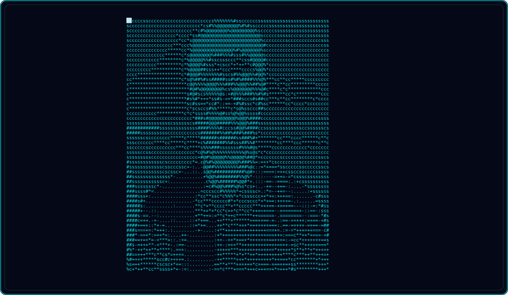

<p align="center">
  
</p>

<!-- 🧠 AI INTRO -->
<p align="center">
  
</p>

## 🚀 What I Do


<br>

```bash
> Designing secure systems & cybersecurity tools

> Building AI-powered intelligent applications

> Developing scalable full-stack platforms

> Solving real-world engineering problems
```

<p align="left">
  
  
  <br><br>
  
  
</p>

---

## 🧰 Tech Stack

### 💻 Programming Languages

<p align="center">
  
</p>

### 🌐 Web Technologies

<p align="center">
  
</p>

### 🗄️ Databases & Cloud

<p align="center">
  
</p>

### ⚙️ Tools & Platforms

<p align="center">
  
</p>

---

## 🖼️ Portfolio Artwork

<p align="center">
  
</p>

<p align="center">
  
</p>

---

## 📡 Live Activities

<p align="center">
  
</p>

<p align="center">
  
</p>

<p align="center">
  
</p>

---

## 🌐 Connect • Network • Explore

<p align="center">
  <a href="https://www.linkedin.com/in/loganth-p-158667280/" target="_blank">
    
  </a>

  <a href="https://leetcode.com/u/loganthp-1910/" target="_blank">
    
  </a>

  <a href="https://www.hackerrank.com/profile/loganth_1925" target="_blank">
    
  </a>

  <a href="mailto:loganthp19@gmail.com" target="_blank">
    
  </a>
</p>

<p align="center">
  
</p>
